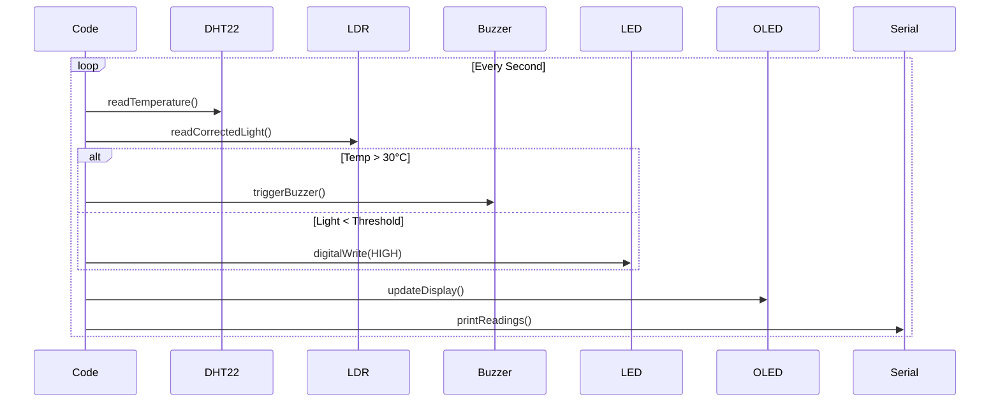
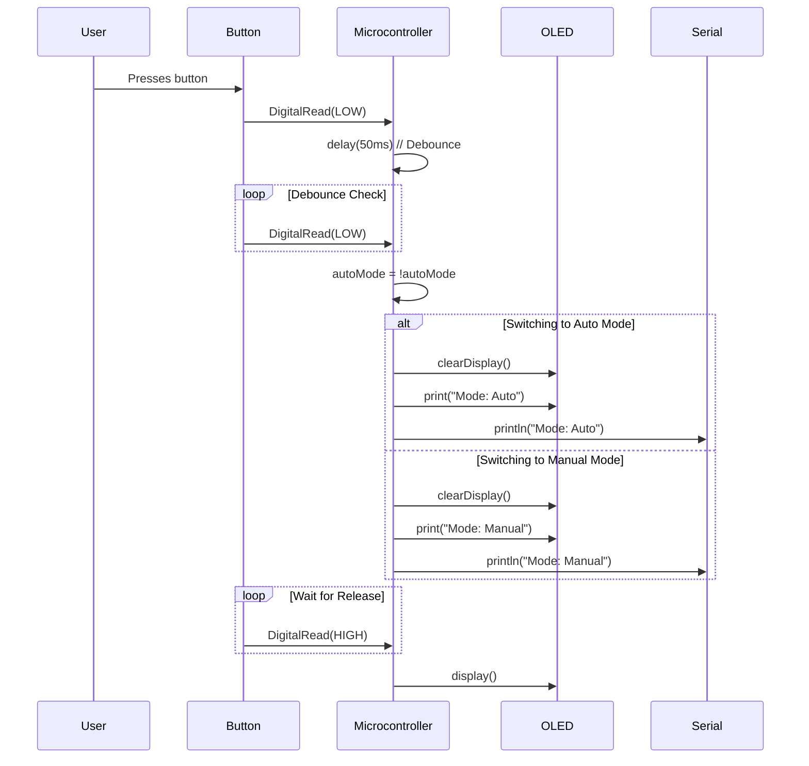
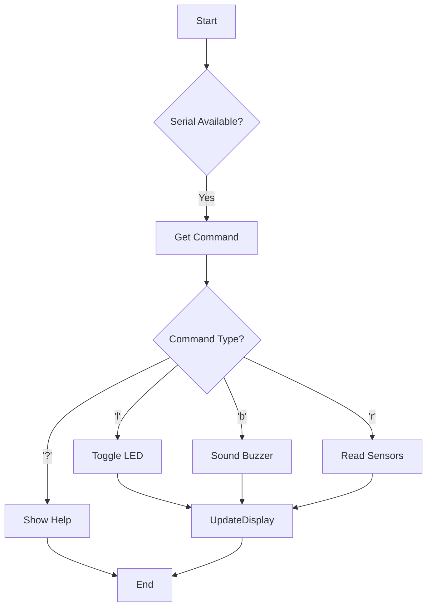

The program starts in auto mode which is essentially a function with the following logic.

To switch from auto to manual the logic is handled as follows

Upon switching from manual the logic of the program is as follows

There was need to define additional function such as `triggerBuzzer()` which ensured the buzzer behaved as intended since `digitalWrite()` did not work as well as `readCorrectedLight()` to map the values of the photoresistor 'correctly' since they were inverted.

Instead of using a capacitor to handle debouncing of the button, it was accounted for in the logic of the program, this requires the user to hold the button for at least 50 milliseconds for the mode to switch.

The readings were stored in a circular buffer, and printed during each refresh.

# Reason For Using C++
I picked C++ as I was using a [wokwi.com](https://wokwi.com/) and it is the default language.
Additionally the project was not extremely complicated so I didn't run into issues like race conditions for example.

